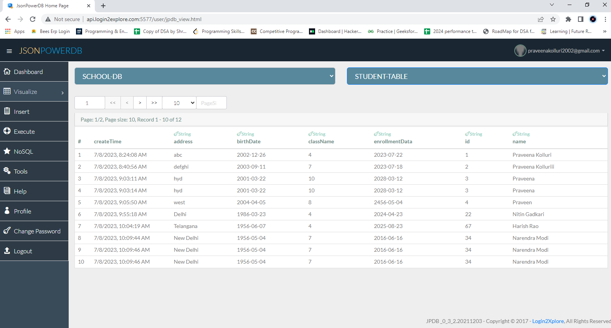

# Student_Enrollment_Form_JsonPowerDB
A Student Enrollment Form made using HTML, CSS and JavaScript connected to JsonPowerDB
<h2> JsonPowerDB </h2>
JsonPowerDB is an easy to use database which does not need any scripting language or a downloaded databade. It is serverless, easy to use and maintain and real-time.
<h4>Benefits </h4>
<ul>
  <li>Predefined algorithms for easy CRUD operations.</li>
  <li>Schema free.</li>
  <li>DBMS built in web makes it faster. </li>
</ul>
<h2>TechStack</h2>
<ul>
  <li>HTML</li>
  <li>CSS</li>
  <li>JavaScript</li>
  <li>JsonPowerDB</li>
</ul>
<h2>Screenshots </h2>

 

<h2>Local Run</h2>
<ul>
  <li>Clone this github project</li>
  <li>Change the connectionToken with the token corresponding to your account.</li>
</ul>
